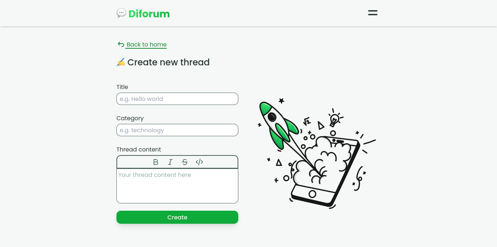

# Diforum
Diforum is a discussion website app that brings people together to share ideas, opinions, and insights on a wide range of topics.

## Screenshot

## Tech stack
1. Vite
2. React.js
3. Typescript
4. Tailwindcss
5. Redux toolkit
6. React router DOM
7. React hook form
8. etc
